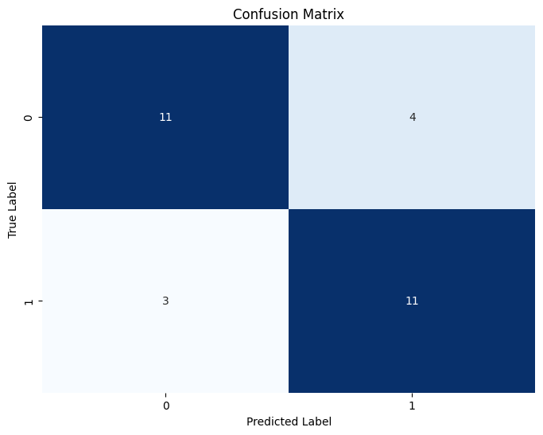
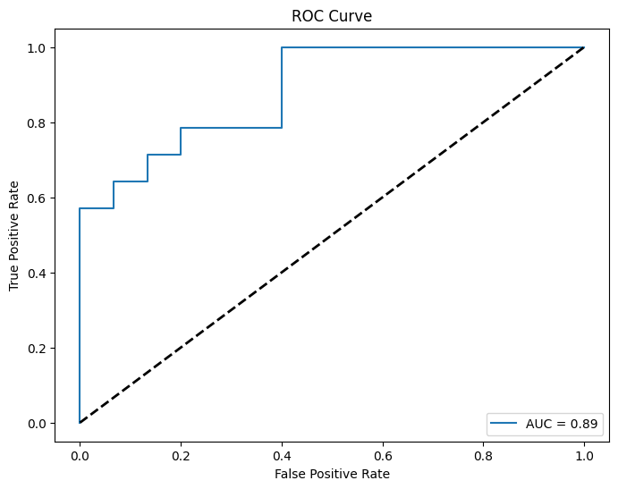

# Covid-19 CT Scan Classification Project

## Overview:

In this project, we aim to develop a deep learning model that classifies whether a patient has COVID-19 based on CT scan images of their lungs. The original dataset was quite large, at 400GB, consisting of CT scans from 300 patients, with each patient having 500 scans.

### Data Preprocessing:
After extensive preprocessing, I successfully reduced the dataset size to 10GB while maintaining key features required for model accuracy.

### Final Dataset Composition:
78 COVID-free patients
78 COVID-positive patients
Each patient has 260 CT scans available for model training and testing.

## Data Preparation

### Problem:
Even after reducing the dataset size, it's essential to further decrease the number of CT scans per patient (currently 260) to improve model efficiency.

### Solution:
Various methods like concatenation (using grids, vectors, or matrices) were attempted but didn't yield satisfactory results. Instead, I applied Discrete Wavelet Transform (DWT) fusion, which merges images by decomposing them into frequency components. This method enhances image clarity and preserves important features, improving diagnostic accuracy in medical imaging.

After applying Discrete Wavelet Transform (DWT) fusion, each patient is now represented by a single image that combines their 260 CT scans.

I'll rename the fused images in a positive sequence for COVID patients and a negative sequence for non-COVID patients, then organize them into one folder. This will make labeling easier in later stages

Now after re-naming, we will check the size of each image and make necessary changes if needed.

In this step, I'll crop 15% of the COVID and non-COVID images separately to remove noise around the edges, such as patient names and dates. By focusing mainly on the lung area and excluding irrelevant information, the model's accuracy should improve.

I will use  the Local Binary Pattern (LBP) to extract texture features from the images by transforming them into frequency patterns. This method enhances the ability to capture fine details within the lung regions. 

## Modeling

With the data preprocessed and ready for modeling, we will use a Random Forest classifier to analyze these features and perform the classification, leveraging its robustness and efficiency for handling high-dimensional data.

## Interpretation and conclusion : 

From the given results the Random Forest model was optimized with the best parameters and achieved the following results:

Global Accuracy: 76%

AUC: 0.89, indicating strong discriminative power between COVID-positive and COVID-free patients.

Precision/Recall: For both classes, precision and recall hover around 0.73 to 0.79, showing a balanced model performance.

Confusion Matrix:

True Positives: 11, True Negatives: 11
False Positives: 4, False Negatives: 3
The model struggles slightly with false positives and negatives but still performs well for the dataset size.
Feature Importance: Only a few features significantly impact the model’s decision-making, while the rest contribute little.

#### Conclusion: 
 The model demonstrates good overall performance in distinguishing between COVID-free and COVID-positive cases.